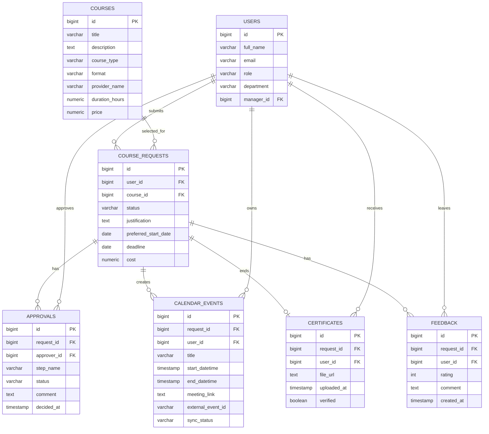

<<<<<<< HEAD
# mpit_2026_unicorn

<h1 align="center">🦄 Unicorn</h1>
<h3 align="center">🚀 ПРОЕКТ "Алроса Обучение"</h3>

  <strong>LMS-платформа для управления обучением, согласованием курсов и аналитикой развития сотрудников</strong>

---

## 📖 Описание проекта

**Алроса Обучение** — это современное веб-приложение для централизованного управления обучением сотрудников ИТ-компании.

Платформа объединяет в одном пространстве:

- внутренний **Корпоративный университет**
- внешние профессиональные курсы
- согласование заявок на обучение
- календарь и дедлайны
- загрузку сертификатов
- аналитику и отчетность

Система помогает сотрудникам быстрее находить подходящее обучение, HR и L&D — автоматизировать рутинные процессы, а руководителям — контролировать развитие команды и обязательное обучение.

---

## 🛠 Технологический стек

### 🌐 Фронтенд
- TypeScript — типизированный JavaScript
- ReactJS — библиотека для построения UI
- NextJS — фреймворк для React
- TailwindCSS / SCSS — стилизация интерфейса
- Axios — HTTP-клиент

### ⚙️ Бэкенд
- Python — основной язык серверной логики
- FastAPI — современный backend framework
- Celery — обработка фоновых задач
- JWT — аутентификация и авторизация
- REST API — взаимодействие между сервисами

### 🗄 Базы данных и инфраструктура
- PostgreSQL — реляционная база данных
- Redis — брокер и кэш
- Docker Compose — оркестрация контейнеров
- Docker — контейнеризация приложения

### 📊 Интеграции и дополнительные возможности
- Outlook Calendar — синхронизация расписания
- Excel / PDF Export — выгрузка отчетов
- Поддержка импортозамещенного ИТ-стека РФ

---

## 🎯 Основной функционал

### 📚 LMS-система
- регистрация и авторизация пользователей
- личный кабинет для каждой роли
- назначение курсов
- отслеживание прогресса обучения
- тестирование сотрудников
- установка дедлайнов
- ведение календаря обучения
- загрузка сертификатов
- экспорт отчетов в Excel и PDF

### 🌐 Модуль внешних курсов
- создание заявки на обучение
- указание стоимости, сроков, программы и ссылки на курс
- прикрепление документов
- согласование по workflow
- контроль бюджетных лимитов
- отслеживание статусов заявки

### 🏫 Корпоративный университет
- запуск внутренних программ обучения
- распределение по направлениям soft skills
- получение обратной связи от тренера
- оценка курса участниками
- выдача сертификатов

### 📅 Интеграция с календарем
- проверка конфликтов в расписании
- автоматическое создание событий в календаре
- напоминания о дедлайнах
- обновление расписания при изменениях
- добавление ссылок на обучение

### 📈 Аналитика
- traceability-отчетность
- контроль заявок и прогресса сотрудников
- отслеживание влияния обучения на подразделения
- контроль использования бюджетов
- формирование прозрачной аналитики для HR и руководителей

---

## 👥 Роли пользователей

| Роль | Описание | Эмодзи |
|------|----------|--------|
| Администратор | Управление системой, ролями и настройками | ⚙️ |
| HR / L&D | Управление обучением, заявками и отчетностью | 📊 |
| Руководитель | Согласование обучения и контроль команды | 🧑‍💼 |
| Сотрудник | Выбор курсов, прохождение обучения, загрузка сертификатов | 👨‍💻 |
| Внутренний тренер | Ведение программ и сбор обратной связи | 👨‍🏫 |

---

## 🚀 Пример пользовательского сценария

### Внешний курс
1. Сотрудник выбирает внешний курс.
2. Заполняет заявку: ссылка, стоимость, сроки, программа.
3. Система проверяет календарь сотрудника на наличие конфликтов.
4. Заявка отправляется на согласование: **Руководитель → HR**.
5. После статуса **«Согласовано»** система:
   - создает событие в календаре
   - устанавливает напоминания
   - фиксирует дедлайны
6. После завершения обучения сотрудник загружает сертификат.
7. Данные автоматически сохраняются в профиле и попадают в аналитику.

---

## 🧠 Направления обучения

- Корпоративные программы
- Личная эффективность
- Управленческая эффективность
- Коммуникативная эффективность
- Корпоративная эффективность
- Цифровая эффективность

---

## 📌 Проблема, которую решает проект

В компании отсутствует единый контур управления обучением сотрудников.  
Из-за этого процессы разрознены, согласование проходит вручную, а данные о развитии сотрудников и квалификации хранятся в разных источниках.

Это приводит к следующим проблемам:

- перегрузка сотрудников при поиске релевантных курсов
- ручная работа HR / L&D с Excel-таблицами и заявками
- конфликты в расписании
- потеря данных о сертификатах и прогрессе
- отсутствие прозрачной аналитики по обучению и бюджетам

---

## 🚀 Инструкция по установке и запуску

### Предварительные требования
- [Node.js](https://nodejs.org/) (LTS версия) ⬇️
- [Docker Desktop](https://www.docker.com/products/docker-desktop) 🐳
- [PNPM](https://pnpm.io/installation) 📦

### 📦 Шаг 1: Клонирование репозитория

    git clone https://github.com/your-team/alrosa-lms.git
    cd alrosa-lms

### 🖥 Шаг 2: Запуск фронтенда

    cd Front
    pnpm install
    pnpm dev

### ⚙️ Шаг 3: Запуск бэкенда

    cd Back
    docker-compose build --no-cache
    docker-compose up

### 🌐 Шаг 4: Доступ к приложению
- http://localhost:3000

---

## 📈 Преимущества решения

- единая точка входа для обучения сотрудников
- автоматизация согласования внешних курсов
- контроль дедлайнов и расписания
- снижение нагрузки на HR и тренеров
- прозрачная система отчетности
- интеграция с рабочим календарем
- удобный доступ к обучению для всех ролей

---

## 👨‍💻 Команда разработки

| Роль | Участник | Эмодзи |
|------|----------|--------|
| Менеджер проекта | [Иванов Алексей](https://github.com/k1maruuu) | 📊 |
| Дизайнер | Фролова Ксения | 🎨 |
| Frontend разработчик | [Голиков Александр](https://github.com/agarogo) | 💻 |
| Backend разработчик | [Максимов Сергей](https://github.com/Serjosuke) | ⚙️ |

---

 <b>Сделано с ❤️ командой Unicorn</b>  🦄 2025 | VK-Tracker 
 

⚙️Схема БД

=======
# Alrosa LearnFlow

Patched project with real Microsoft Graph / Outlook Calendar integration, two-step approval workflow, HR dashboard metrics, internal calendar, and ready-to-run `.env` templates.

## Smart external search update
- `GET /api/v1/courses/external-search?q=...` — unified search for HR, managers, and employees.
- Uses OpenAI Responses API with built-in web search when `OPENAI_API_KEY` is set. Falls back to local catalog when key is absent.
- HR can favorite external courses and assign them to one or many employees.
- Employees can submit external courses for approval with justification.
- Recommended HR favorites are pushed to the top of results; internal courses remain highest-priority in schedule conflicts.
>>>>>>> full_test
