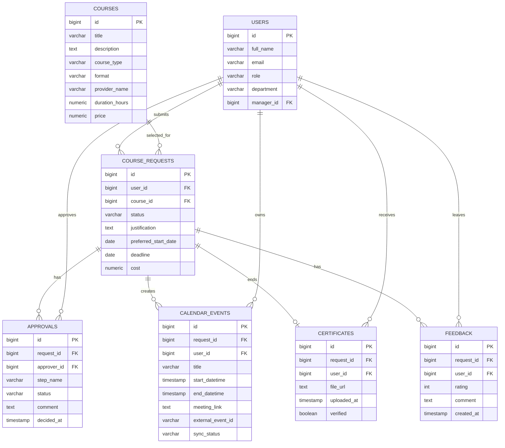

# mpit_2026_unicorn

Схема бд

```mermaid
erDiagram
    USERS ||--o{ COURSE_REQUESTS : submits
    COURSES ||--o{ COURSE_REQUESTS : selected_for
    COURSE_REQUESTS ||--o{ APPROVALS : has
    USERS ||--o{ APPROVALS : approves
    COURSE_REQUESTS ||--o{ CALENDAR_EVENTS : creates
    USERS ||--o{ CALENDAR_EVENTS : owns
    COURSE_REQUESTS ||--o| CERTIFICATES : ends
    USERS ||--o{ CERTIFICATES : receives
    COURSE_REQUESTS ||--o{ FEEDBACK : has
    USERS ||--o{ FEEDBACK : leaves

    USERS {
        bigint id PK
        varchar full_name
        varchar email
        varchar role
        varchar department
        bigint manager_id FK
    }

    COURSES {
        bigint id PK
        varchar title
        text description
        varchar course_type
        varchar format
        varchar provider_name
        numeric duration_hours
        numeric price
    }

    COURSE_REQUESTS {
        bigint id PK
        bigint user_id FK
        bigint course_id FK
        varchar status
        text justification
        date preferred_start_date
        date deadline
        numeric cost
    }

    APPROVALS {
        bigint id PK
        bigint request_id FK
        bigint approver_id FK
        varchar step_name
        varchar status
        text comment
        timestamp decided_at
    }

    CALENDAR_EVENTS {
        bigint id PK
        bigint request_id FK
        bigint user_id FK
        varchar title
        timestamp start_datetime
        timestamp end_datetime
        text meeting_link
        varchar external_event_id
        varchar sync_status
    }

    CERTIFICATES {
        bigint id PK
        bigint request_id FK
        bigint user_id FK
        text file_url
        timestamp uploaded_at
        boolean verified
    }

    FEEDBACK {
        bigint id PK
        bigint request_id FK
        bigint user_id FK
        int rating
        text comment
        timestamp created_at
    }
```
